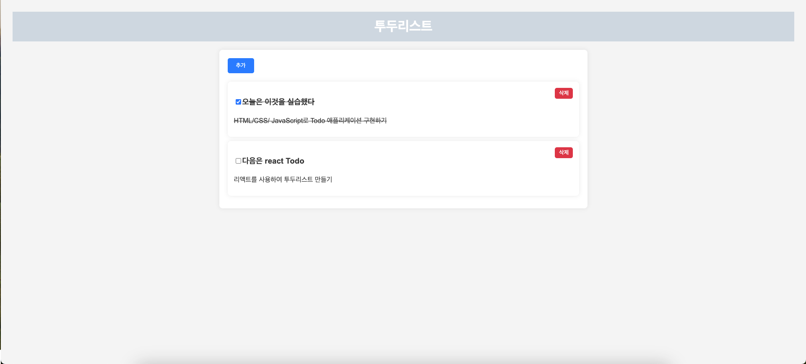

<h1>HTML/CSS/ JavaScript로 Todo 애플리케이션 구현하기</h1>
<ul>
    <h3>실습 목표</h3>
    <li>HTML 시멘틱 구조에 대한 이해</li>
    <li>다양한 HTML 요소 선택자를 활용한 문서 스타일링</li>
    <li>DOM 조작 및 이벤트 처리</li>
    <h3>요구사항</h3>
    <li>Todo 항목을 입력할 수 있는 입력 필드와 추가 버튼 요소를 포함합니다.</li>
    <li>Todo 항복 목록을 볼 수 있는 요소를 포함합니다./li>
    <li>추가 버튼을 클릭하면 새로운 Todo 항목을 추가하는 기능을 구현합니다.</li>
    <li>체크 박스 입력 필드 혹은 삭제 버튼을 클릭하면 Todo 항목을 완료 처리하거나 삭제하는 기능을 구현합니다.</li>
    <li>Todo 항복이 완료 처리된 경우, text-decoration-line: line-through;
스타일링을 적용할 수 있습니다. (다른 방법도 OK!)</li>
    <h3>한 걸음 더</h3>
    <li>페이지를 새로고침 해도 Todo 목록이 유지되도록 로컬 스토리지에 데이터를 저장하고 불러오는 기능을 구현합니다.</li>
</ul>
</img>